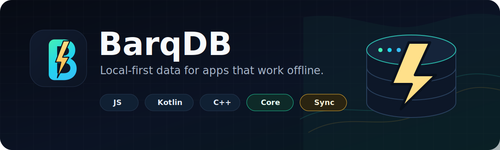

<p align="center">
  
</p>

# BarqDB

BarqDB is a local-first database stack for apps that need fast offline data and optional sync.

The project includes SDKs for JavaScript, React Native, Kotlin, and C++, powered by a shared native core.

## What We Build

| Repository | Purpose |
| --- | --- |
| [barq-js](https://github.com/BarqDB/barq-js) | JavaScript and React Native SDK |
| [barq-kotlin](https://github.com/BarqDB/barq-kotlin) | Kotlin Multiplatform SDK |
| [barq-core](https://github.com/BarqDB/barq-core) | Native database core and sync foundation |
| [barq-native](https://github.com/BarqDB/barq-native) | C++ SDK built on barq-core |

## Quick Start

```sh
npm install @barqdb/barq
```

```ts
import { Barq } from "@barqdb/barq";

const barq = await Barq.open({ schema: [Task] });
```

## Project Status

BarqDB is under active development. APIs may change while the SDKs stabilize.

## Focus

- Fast local reads and writes
- Offline-first app data
- Optional sync through barq-core
- SDKs that feel native in each platform

## License

BarqDB projects are licensed under Apache-2.0 unless a repository says otherwise.
